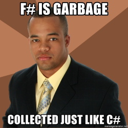

# F#


## Checking the sample code

```F# runnable
open System
open System.Text.RegularExpressions

(* Console.In.ReadLine().ToCharArray() *)
"CG".ToCharArray()
    |> Array.map (fun c -> Convert.ToString(int c, 2).PadLeft(7, '0'))
    |> String.Concat
    |> fun s -> Regex.Matches(s, "(.)\1*")
    |> Seq.map (fun m -> m.ToString())
    |> Seq.map (fun s -> (if s.[0] = '1' then "0 " else "00 ") + (String.replicate s.Length "0"))
    |> String.concat " "
    |> printfn "%s"
```

## Looking at the syntax

- This is very different from an imperative style code! A proper introduction to _functional programming_ (FP) is unfortunately beyond the scope of this playground.
- `|>` is the pipe forward operator, used to chain the function calls.
- Comments are between `(*` and `*)`. Don't ask...
- There are some function names (`Convert.ToString` and `PadLeft`) which look exactly the same as in our _C#_ solution. This is not a coincidence. As _C#_, _F#_ and _VB .NET_ are all targeting Microsoft's _Common Language Infrastructure (CLI)_ on _.NET Core_, they share some of the standard libraries.
- `fun x ->` defines anonymous functions on the fly.
- `if`..`then`..`else` is not a conditional statement, but a conditional expression so it returns a result.

## Other characteristics

_F#_ defines itself as "_functional-**first**_" programming language. Unlike _Haskell_, which is pure, uncompromising FP, with _F#_ you can mix in some imperative or object-oriented style in your code, when it makes sense.
However, this can be abused. To demonstrate, I show an F# `Chuck Norris` solution in imperative style. **Don't try this at home!** :-)

```F# runnable
open System
(* let m = Console.In.ReadLine() *)
let m = "CG"
let c = [| "00"; "0" |]
let mutable b = ""
for ch in m do
    b <- b + Convert.ToString(ch |> int, 2).PadLeft(7, '0')
let mutable a = ""
a <- a + c.[(b.[0] |> int) - ('0' |> int)] + " 0"
for i = 1 to (String.length b) - 1 do
    if b.[i] = b.[i - 1] then
        a <- a + "0"
    else
        a <- a + " " + c.[(b.[i] |> int) - ('0' |> int)] + " 0"
(* eprintfn "Debug message" *)
printfn "%s" a
```

## Resources to check

- [Overview on Wikipedia](https://en.wikipedia.org/wiki/F_Sharp_(programming_language))
- [Official tutorial](https://fsharp.org/learn/index.html)



## Coming next...

The natural choice for the next section is the _"most-FP language of all FP languages"_, **Haskell**...
