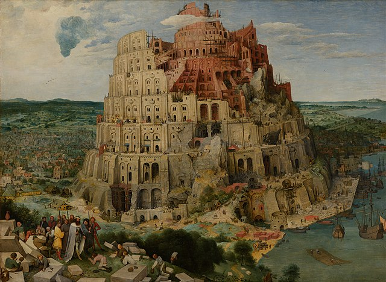

# A Babel of Languages on CodinGame

**Note: WORK IN PROGRESS! - Feedbacks and contributions welcome!**

**CodinGame** currently supports [**27** different programming languages](https://www.codingame.com/faq).
This provides us an excellent opportunity to leave the comfort zone of the language we regularly use, and to check out some new stuff!
This `tech.io` article will explore some of the basic characteristics of these programming languages.

We will do this by examining a simple code snippet - the sample solution for the very same puzzle in each language.
This article is not meant as a full-fledged language tutorial, we can really just scratch the surface in such short time. If you get interested in any of the languages, some links are provided for further study.

You are also encouraged to (re)visit some of the [practice puzzles](https://www.codingame.com/training) on CodinGame, and try to solve them in a new language!
Some frustration is guaranteed, but expect also some nice '_A-ha!_' moments. As a bonus, some CodinGame achievements will also unlock.

~~Screenshot from Sid Meier's Civilization VII~~ _The Tower of Babel by Pieter Bruegel the Elder (1563)_

## The sample puzzle

Throughout this article, I use the easy practice puzzle '[Chuck Norris](https://www.codingame.com/training/easy/chuck-norris)', as the example code. It is short, but already includes multiple language constructs. The sample solutions shown are not the shortest, nor the fastest code possible, they serve just as a common starting point for comparing the languages.

If you haven't solved this puzzle yet, _I highly recommend_ to **try to solve it** in your favourite coding language, **before** continuing reading this article! I will not discuss the puzzle itself, or how the solution works. The focus of this article is solely the diversity of the programming languages. While technicaly you can copy the sample solutions to the puzzle IDE for a quick success of submit, but you will miss the learning opportunity by doing so.

_Note: In order the code snippets remain runable in tech.io, I commented out the line that reads input from the standard stream, and replaced it with a constant input. For the real puzzle, of course you will need to read the input for the test cases._

## Languages covered

I recommend reading this article in order, because the language under consideration is compared to languages, that were already dealt with and only new features are highlighted. This order is nothing to do with the language popularity, but I did some grouping to make the discussion a bit easier to read.

* If you insist, you can still jump to a specific part of the article by using the direct links below:
[C#](https://tech.io/playgrounds/3ea74998ed025233981b1c165b9698b479965/a-babel-of-languages-on-codingame/cs)
[Java](https://tech.io/playgrounds/3ea74998ed025233981b1c165b9698b479965/a-babel-of-languages-on-codingame/java)
[PHP](https://tech.io/playgrounds/3ea74998ed025233981b1c165b9698b479965/a-babel-of-languages-on-codingame/php)
[Python](https://tech.io/playgrounds/3ea74998ed025233981b1c165b9698b479965/a-babel-of-languages-on-codingame/python)
[JavaScript](https://tech.io/playgrounds/3ea74998ed025233981b1c165b9698b479965/a-babel-of-languages-on-codingame/javascript)
[C++](https://tech.io/playgrounds/3ea74998ed025233981b1c165b9698b479965/a-babel-of-languages-on-codingame/cpp)
[C](https://tech.io/playgrounds/3ea74998ed025233981b1c165b9698b479965/a-babel-of-languages-on-codingame/c)
[Rust](https://tech.io/playgrounds/3ea74998ed025233981b1c165b9698b479965/a-babel-of-languages-on-codingame/rust)
[Haskell](https://tech.io/playgrounds/3ea74998ed025233981b1c165b9698b479965/a-babel-of-languages-on-codingame/haskell)
[F#](https://tech.io/playgrounds/3ea74998ed025233981b1c165b9698b479965/a-babel-of-languages-on-codingame/fs)
[Bash](https://tech.io/playgrounds/3ea74998ed025233981b1c165b9698b479965/a-babel-of-languages-on-codingame/bash)
[Dart](https://tech.io/playgrounds/3ea74998ed025233981b1c165b9698b479965/a-babel-of-languages-on-codingame/dart)
[Go](https://tech.io/playgrounds/3ea74998ed025233981b1c165b9698b479965/a-babel-of-languages-on-codingame/go)
[Groovy](https://tech.io/playgrounds/3ea74998ed025233981b1c165b9698b479965/a-babel-of-languages-on-codingame/groovy)
[Kotlin](https://tech.io/playgrounds/3ea74998ed025233981b1c165b9698b479965/a-babel-of-languages-on-codingame/kotlin)
[Perl](https://tech.io/playgrounds/3ea74998ed025233981b1c165b9698b479965/a-babel-of-languages-on-codingame/perl)
[Ruby](https://tech.io/playgrounds/3ea74998ed025233981b1c165b9698b479965/a-babel-of-languages-on-codingame/ruby)
[Scala](https://tech.io/playgrounds/3ea74998ed025233981b1c165b9698b479965/a-babel-of-languages-on-codingame/scala)
[Swift](https://tech.io/playgrounds/3ea74998ed025233981b1c165b9698b479965/a-babel-of-languages-on-codingame/swift)
[VB.NET](https://tech.io/playgrounds/3ea74998ed025233981b1c165b9698b479965/a-babel-of-languages-on-codingame/vbnet)

* These are supported on `CodinGame` but not supported on `tech.io`:
[Clojure](https://tech.io/playgrounds/3ea74998ed025233981b1c165b9698b479965/a-babel-of-languages-on-codingame/clojure)
[D](https://tech.io/playgrounds/3ea74998ed025233981b1c165b9698b479965/a-babel-of-languages-on-codingame/d)
[Lua](https://tech.io/playgrounds/3ea74998ed025233981b1c165b9698b479965/a-babel-of-languages-on-codingame/lua)
[ObjectiveC](https://tech.io/playgrounds/3ea74998ed025233981b1c165b9698b479965/a-babel-of-languages-on-codingame/objectivec)
[OCaml](https://tech.io/playgrounds/3ea74998ed025233981b1c165b9698b479965/a-babel-of-languages-on-codingame/ocaml)
[Pascal](https://tech.io/playgrounds/3ea74998ed025233981b1c165b9698b479965/a-babel-of-languages-on-codingame/pascal)
[TypeScript](https://tech.io/playgrounds/3ea74998ed025233981b1c165b9698b479965/a-babel-of-languages-on-codingame/typescript)

[Conclusion](https://tech.io/playgrounds/3ea74998ed025233981b1c165b9698b479965/a-babel-of-languages-on-codingame/outro)

## Let's get started!
