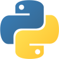

# Python



## Checking the sample code

```python runnable
import sys
# m = input()
m = "CG"
c = ("00", "0")
b = ""
for w in m:
    b += bin(ord(w))[2:].zfill(7)
ans = c[int(b[0])] + " 0"
for i in range(1, len(b)):
    ans += '0' if b[i] == b[i - 1] else " " + c[int(b[i])] + " 0"
# print("debug message...", file=sys.stderr, flush=True)
print(ans)
```

## Looking at the syntax
Even if it is almost a line-by-line conversion of the same imperative-style solution we saw in the previous chapter, the syntax is quite different!
- Whitespace matters. Blocks for loops and conditional statements are indented. There are no curly braces `{ }` or semicolons `;`.
- Type system is dynamic.
- Instead of the traditional `if` statement, here I show _Python_'s ternary operator


## Other characteristics

- TODO

## Resources to check

- [Overview on Wikipedia](https://en.wikipedia.org/wiki/Python_(programming_language))
- [Official tutorial](https://docs.python.org/3/tutorial/index.html)
- [w3schools tutorial](https://www.w3schools.com/python/)

## Coming next...

Before moving to 'more serious matter' let's another weakly typed, interpreted language which became the de-facto language of web front-ends: **JavaScript**!
