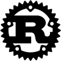
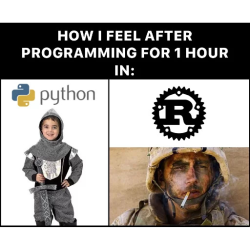

# Rust



## Checking the sample code

```rust runnable
//use std::io;
//macro_rules! parse_input {
//    ($x:expr, $t:ident) => ($x.trim().parse::<$t>().unwrap())
//}
fn main() {
    // let mut input_line = String::new();
    // io::stdin().read_line(&mut input_line).unwrap();
    // let m = input_line.trim_matches('\n').to_string();
    let m = "CG";
    let c = ["00", "0"];
    let mut b = "".to_string();
    for ch in m.chars() {
        let g = format!("{:0>7b}", ch as u8);
        b.push_str(&g);
    }
    let l: u8 = b.as_bytes()[0];
    let mut a = c[(l - b'0') as usize].to_string();
    a.push_str(&" 0".to_string());
    for i in 1..b.len() as usize {
        if b.as_bytes()[i] == b.as_bytes()[i - 1] {
            a.push_str(&"0".to_string());
        } else {
            a.push_str(&" ".to_string());
            a.push_str(&c[(b.as_bytes()[i] - b'0') as usize].to_string());
            a.push_str(&" 0".to_string());
        }
    }
    // eprintln!("Debug message...");
    println!("{}", a);
}
```

## Looking at the syntax

- TODO

## Other characteristics

- TODO

## Resources to check

- [Overview on Wikipedia](https://en.wikipedia.org/wiki/Rust_(programming_language))
- [Official tutorial](https://www.rust-lang.org/learn)



## Coming next...
